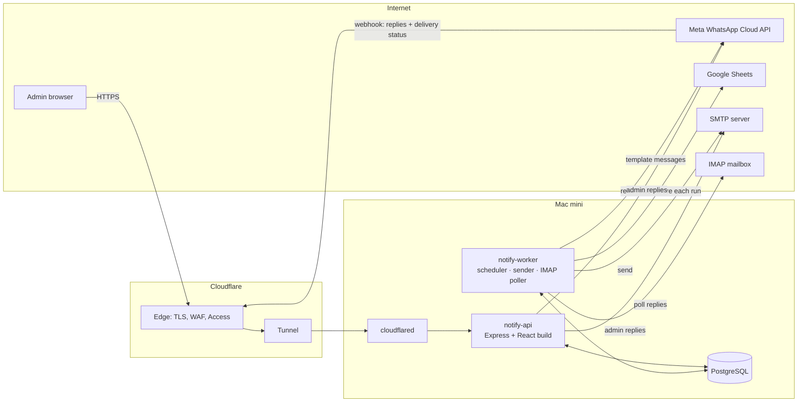
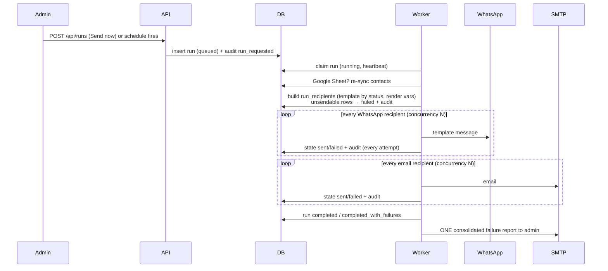
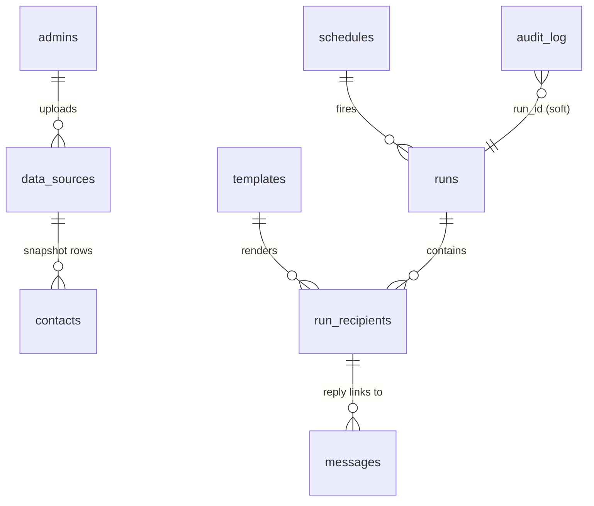

# Architecture

## Components



- **notify-api** serves the dashboard and REST API, receives the WhatsApp webhook, and handles uploads, templates, schedules and inbox replies. It never sends bulk messages.
- **notify-worker** turns due schedules into runs, claims queued runs (`FOR UPDATE SKIP LOCKED`), sends them, writes the audit log, emails the failure report, and polls IMAP for email replies.
- They communicate **only through PostgreSQL**. No Redis or message broker is needed at this scale.

## Send flow



**Rules enforced in the engine** (`server/src/services/runner.js`)

| Situation | Result |
|---|---|
| Contact has WhatsApp and email | two recipients; WhatsApp is sent in phase 1, email in phase 2 |
| No valid WhatsApp number or email | `failed`: "No valid WhatsApp number or email" |
| No template for the status (and no `*` template) | `failed`: "No template for status …" |
| A variable used by the template is empty for this contact (e.g. amount) | `failed`: "Missing value(s) in sheet for: amount". Never sent with a blank. |
| Channel switched off in that status's template | `skipped` |
| Provider error 429/5xx/network/throttling | retried up to `SEND_MAX_ATTEMPTS` (1 s, 4 s back-off); every attempt is audited |
| Provider error 4xx (invalid number, not on WhatsApp…) | `failed` immediately |
| Admin stops the run | remaining recipients `skipped`; run `cancelled` |
| Worker crashes mid-run | another start reclaims it after `STALE_RUN_MS`; messages that were mid-send are marked failed ("interrupted"), not re-sent |
| Second "Send now" while a run is active | rejected (409) to avoid double-sending |

## Data model



| Table | Purpose |
|---|---|
| `admins` | dashboard users (bcrypt hashes) |
| `data_sources` | uploaded file or Google Sheet; exactly one `is_active` |
| `contacts` | rows of a source: `name`, `whatsapp` (digits), `email`, `status`, `amount`, every column in `fields` JSONB, `warnings` |
| `templates` | per `status_key`: WhatsApp (Meta template name, language, param mapping, preview text) and email (subject, body) |
| `schedules` | `next_run_at`, optional `cron` + `timezone`, `active / cancelled / completed` |
| `runs` | one execution: trigger, status, counts, `failure_report`, `admin_notified_at`, heartbeat |
| `run_recipients` | work queue: one row per contact × channel, with rendered content, state, attempts, provider message id |
| `messages` | Replies inbox: inbound replies and admin answers |
| `audit_log` | **append-only**, hash-chained record of everything |
| `imap_state` | last processed IMAP UID |
| `settings` | automation settings (reminders, privacy, balance) |
| `reminder_sends` | which reminder stage was delivered for which account and due date |
| `consents` | Data Privacy Notice answers from people outside the contact list |
| `telegram_links` | Telegram chat ↔ phone number, created when a resident shares their number with the bot |

### Audit log integrity

- A `BEFORE UPDATE OR DELETE` row trigger and a `BEFORE TRUNCATE` trigger raise an error, so the app (or anyone using the app's account) cannot alter history.
- `hash = sha256(prev_hash | canonical_json(entry))`. Writes are serialized with a transaction-level advisory lock, so the chain is strictly linear.
- `GET /api/audit/verify` (the **Verify integrity** button) recomputes every hash. A superuser editing a row directly is detected (covered by a test).
- Delivery receipts don't modify earlier entries. Each receipt is appended as a new `delivery_status` entry.
- Optional: `deploy/db-roles.sql` revokes UPDATE/DELETE/TRUNCATE on `audit_log` from the runtime DB role.
- Events: `login`, `login_failed`, `password_changed`, `source_activated`, `source_synced`, `source_sync_failed`, `template_created/updated/deleted`, `schedule_created/cancelled/fired`, `run_requested`, `run_started`, `run_resumed`, `message_sent`, `send_failed` (status `retrying` or `failed`), `send_skipped`, `channel_completed`, `run_completed`, `run_failed`, `run_cancel_requested`, `admin_notified`, `admin_notify_failed`, `delivery_status`, `reply_received`, `reply_sent`, `reply_failed`, `test_sent`, `test_failed`.

## API reference

All `/api` routes except `/api/auth/login` require the session cookie. Every state-changing call must send `X-Requested-With: notify` (CSRF protection), and bodies are JSON. Errors look like `{"error": "message"}` with a 4xx/5xx status.

### Auth
| Method & path | Body | Response |
|---|---|---|
| `POST /api/auth/login` | `{"email","password"}` | `{"admin":{"id","email","name"}}` + `notify_session` cookie (httpOnly, Secure, SameSite=Strict) |
| `POST /api/auth/logout` | – | `{"ok":true}` |
| `GET /api/auth/me` | – | `{"admin":{…}}` |
| `POST /api/auth/password` | `{"current","next"}` (12+ chars) | `{"ok":true}` |

### Source and contacts
| Method & path | Body | Response |
|---|---|---|
| `POST /api/sources/upload` | multipart `file` (.csv/.xls/.xlsx, ≤ `MAX_UPLOAD_MB`) | `201 {"source":{…},"mapping":{"name":"full_name","whatsapp":"phone",…},"summary":{"rows":120,"withWhatsapp":100,"withEmail":90,"withWarnings":3,"statuses":["overdue","reminder"]}}` |
| `POST /api/sources/google` | `{"url":"https://docs.google.com/spreadsheets/d/…/edit#gid=0"}` | same as upload |
| `POST /api/sources/:id/sync` | – | `{"source","summary","synced":true}` |
| `GET /api/sources` · `/active` | – | `{"sources":[…]}` · `{"source":{…}\|null}` |
| `GET /api/sources/contacts?search=&warnings=1&limit=100&offset=0` | – | `{"source","contacts":[{"id","row_number","name","whatsapp","email","status","amount","fields":{…},"warnings":[]}],"total"}` |
| `GET /api/sources/statuses` | – | `{"statuses":[{"status":"overdue","contacts":40,"template_id":1}]}` |

### Templates
| Method & path | Body | Response |
|---|---|---|
| `GET /api/templates` | – | `{"templates":[…]}` |
| `POST /api/templates` · `PUT /api/templates/:id` | see below | `{"template":{…}}` (409 if the status already has one) |
| `DELETE /api/templates/:id` | – | `{"ok":true}` |
| `POST /api/templates/preview` | `{"wa_body","email_subject","email_body","wa_template_name","wa_params","contact_id"?}` | `{"variables":[…],"whatsapp":{"text","missing","params"},"email":{"subject","body","missing"}}` |

```json
{
  "status_key": "overdue",
  "label": "Overdue notice",
  "wa_enabled": true,
  "wa_template_name": "payment_overdue",
  "wa_language": "en_US",
  "wa_params": ["name", "amount_formatted", "due_date"],
  "wa_body": "Hi {{name}}, your balance of {{amount_formatted}} was due on {{due_date}}.",
  "email_enabled": true,
  "email_subject": "Overdue balance: {{amount_formatted}}",
  "email_body": "Dear {{name}},\n\nYour balance of {{amount_formatted}} was due on {{due_date}}."
}
```

### Schedules and runs
| Method & path | Body | Response |
|---|---|---|
| `GET /api/schedules` | – | `{"schedules":[…],"timezone":"Asia/Kuala_Lumpur"}` |
| `POST /api/schedules` | one-time `{"name","run_at":"2026-11-01T01:00:00Z"}` or repeating `{"name","cron":"0 9 1 * *","timezone":"Asia/Kuala_Lumpur"}` | `201 {"schedule":{"id","next_run_at","status":"active",…}}` |
| `POST /api/schedules/:id/cancel` | – | `{"schedule":{…,"status":"cancelled"}}` |
| `POST /api/runs` (send now) | – | `202 {"run":{"id","status":"queued"}}` · 409 if a run is active |
| `GET /api/runs` | – | `{"runs":[…]}` |
| `GET /api/runs/:id?state=failed` | – | `{"run":{…,"failure_report":[{"contact_name","row_number","channel","address","error"}]},"recipients":[…],"progress":[{"channel","state","n"}]}` |
| `POST /api/runs/:id/cancel` | – | queued → `cancelled`; running → `cancel_requested` |
| `GET /api/runs/:id/failures.csv` | – | CSV of affected contacts |

### Audit, inbox, dashboard, settings
| Method & path | Response |
|---|---|
| `GET /api/audit?event=&channel=&status=&run_id=&search=&from=&to=&limit=&offset=` | `{"entries":[…],"total"}` |
| `GET /api/audit/verify` | `{"ok":true,"checked":1234,"head":"…"}` or `{"ok":false,"brokenAt":57,"reason":"content hash mismatch"}` |
| `GET /api/audit/export.csv?…` | streamed CSV (formula-injection safe) |
| `GET /api/inbox?unread=1` | `{"conversations":[{"channel","address","contact_name","last_at","unread","last_body"}]}` |
| `GET /api/inbox/thread?channel=whatsapp&address=60121…` | `{"messages":[…],"notifications":[…]}` (marks read) |
| `POST /api/inbox/reply` `{"channel","address","body","subject"?}` | `201 {"message":{…}}`. WhatsApp only within 24 h of the contact's last message. |
| `GET /api/dashboard` | tiles, recent runs, 14-day activity, statuses missing templates |
| `GET /api/settings/status` | provider configuration (no secrets) |
| `POST /api/settings/test` `{"channel","to","template_name"?}` | `{"ok":true,"id"}` |

### Automations
| Method & path | Body / response |
|---|---|
| `GET /api/automations` | `{"settings":{"reminders":{…},"privacy":{…},"balance":{…}},"lastReminderRun":{"date","run_id"},"consents":{"accepted":3,"declined":1}}` |
| `PUT /api/automations/reminders` | `{"enabled":true,"time":"09:00","unpaid_statuses":["unpaid"],"rules":[{"days":5,"template":"reminder_5"},{"days":14,"template":"reminder_14"},{"days":30,"template":"final_30"}]}` |
| `PUT /api/automations/privacy` | `{"enabled","notice","accepted_reply","declined_reply","invalid_reply","yes_words":[…],"no_words":[…]}` |
| `PUT /api/automations/balance` | `{"enabled","keywords":[…],"reply","paid_reply","not_found_reply"}` |
| `GET /api/automations/reminders/preview` | `{"today":"2026-10-06","items":[{"name","unit","due_date","days_overdue":6,"stage":5,"template":"reminder_5","template_exists":true}]}` (dry run) |
| `POST /api/automations/reminders/run` | `202 {"run":{…,"kind":"reminders"}}` |
| `POST /api/automations/balance/preview` `{"to":"012-…"}` | `{"text":"Hello Ben, …","rows":[3]}` |
| `GET /api/automations/consents?status=accepted` · `/consents/export.csv` | consent records |

**Reminder rules**: the worker queues one `kind = reminders` run per day after `reminders.time` (in `APP_TIMEZONE`). The run re-syncs the sheet and selects rows whose status is in `unpaid_statuses` and that have a due date. For each row it picks the **highest** stage whose day count has passed, and skips it if `reminder_sends` already holds `(contact, due date, stage)`. Rows are recorded in `reminder_sends` only after a successful send, so a failed reminder is retried the next day and also appears in that day's failure report.

**Inbound automations** run after the webhook has been acknowledged (WhatsApp) or after an IMAP message is stored (email):
1. *Privacy* (WhatsApp only): a sender with a `pending` consent record → YES/NO is classified and recorded. A sender who is not in the active sheet and has no consent record → the notice is sent and a `pending` record is created. Known residents never get the notice.
2. *Balance*: keyword match → re-sync the Google Sheet (at most once a minute) → one reply covering every row with that number or email. If a value the reply needs is missing, no automatic reply is sent and the admin answers manually.

Every automatic reply is stored in the inbox (`messages.auto = true`) and audited (`auto_reply_sent`, `privacy_notice_sent`, `privacy_consent_accepted` / `privacy_consent_declined`, `balance_inquiry`).

### Chat channels (`TELEGRAM_ENABLED`, `WHATSAPP_ENABLED`)
- One chat message per person, chosen per contact: **Telegram** if their phone is linked to the bot, else **WhatsApp** if enabled, plus **email** if they have an address. Send order: Telegram list, WhatsApp list, email list.

### Telegram
- The worker long-polls `getUpdates` (no webhook or public URL needed) and stores the offset in `settings.telegram_offset`.
- `/start` → welcome + `request_contact` keyboard. A shared contact is accepted only if `contact.user_id == from.id`. The phone is normalized, and the row `telegram_links(chat_id, phone, …)` is upserted. Earlier messages filed under `tg:<chat_id>` move to the phone-number thread.
- Contacts are matched on the phone number (`contacts.whatsapp` column, labelled *Mobile*). Inbox threads, consents, balance lookups and reminders therefore work the same on Telegram and WhatsApp.
- With WhatsApp off, a phone contact without a link becomes `skipped` (if it has an email) or `failed` (if not). A 403 from Telegram sets `telegram_links.blocked_at`, so later runs fall back to WhatsApp for that person.
- The chat-message text of each template (`wa_body`) is sent as-is on Telegram; the Meta template name and parameters are only used on WhatsApp.

### Webhooks (public)
| Method & path | Notes |
|---|---|
| `GET /webhooks/whatsapp` | Meta verification (`hub.verify_token` must equal `WHATSAPP_VERIFY_TOKEN`) |
| `POST /webhooks/whatsapp` | `X-Hub-Signature-256` HMAC checked against `WHATSAPP_APP_SECRET`; stores replies (deduplicated by wamid) and appends delivery statuses |
| `GET /healthz` | `{"ok":true}` / 503 |

## Concurrency strategy

- **Processes**: PM2 runs `notify-api` (1 process) and `notify-worker` (1 process), restarts them on crash or memory over 512 MB, and starts them at boot through launchd.
- **Database**: `pg` pool per process (`DB_POOL_MAX=10`). Bulk inserts are chunked (300–500 rows per statement).
- **Sending**: a bounded promise pool per channel (`WHATSAPP_CONCURRENCY`, `EMAIL_CONCURRENCY`). SMTP uses a pooled transport. Cancellation is checked between messages, at most every 2 s.
- **Job safety**: schedules and runs are claimed with `FOR UPDATE SKIP LOCKED`, so running extra workers is safe. A heartbeat every 15 s lets a dead worker's run be resumed.
- **Load**: 100–500 concurrent dashboard users is far below what one Node process and Postgres can handle. Pages poll every 3–30 s; all list endpoints are paginated and indexed.

## Security

- The app binds to `127.0.0.1`. Only `cloudflared` can reach it, and there are no open inbound ports. Cloudflare provides TLS, WAF and rate limiting, and **Cloudflare Access** is recommended in front of the dashboard (bypassing `/webhooks/*`).
- Sessions: signed JWT in an httpOnly, Secure, `SameSite=Strict` cookie that expires after 12 h. bcrypt (cost 12). Login is rate-limited (10 per 15 min per IP) and failures are audited with timing-uniform responses. The API is rate-limited at 600/min.
- CSRF: SameSite=Strict, an Origin check against `PUBLIC_URL`, and a required `X-Requested-With` header.
- Helmet security headers with a strict CSP (`frame-ancestors 'none'`, same-origin scripts only).
- Input validation with zod on every body. SQL is parameterized everywhere. Uploads are capped in size and limited by extension and parser. CSV exports neutralize `=`, `+`, `-` and `@` formula injection. Outbound email is plain text escaped into HTML.
- Webhook HMAC is verified with a constant-time comparison. Inbound messages are deduplicated.
- Secrets live only in `server/.env` (chmod 600, git-ignored). Logs redact cookies, authorization headers and passwords. `/api/settings/status` never returns secrets.
- Personal data stays on the Mac and in Postgres. Use FileVault, encrypt backups, and limit who has dashboard accounts.
- Dependencies were audited with `npm audit`: 0 known vulnerabilities at the time of writing. SheetJS comes from its official CDN because the npm copy is outdated.

## Logging and monitoring

| What | Where |
|---|---|
| Structured app logs (pino JSON, one line per request, run and error) | stdout → PM2 logs, plus `LOG_FILE` (rotated by newsyslog) |
| Business audit trail | `audit_log` table, the Audit page, CSV export |
| Per-run results and failure reports | Send history page, plus the admin email |
| Health | `GET /healthz` checks the DB connection; point an uptime monitor at it |
| Process metrics | `pm2 monit` / `pm2 status` |
| Optional | ship JSON logs with Vector or Grafana Alloy to Grafana Cloud, Better Stack or Datadog; alert on `level>=50` and on `run_failed` |

## Migration plan for scaling

1. **More volume on the same Mac**: raise `WHATSAPP_CONCURRENCY` (Meta allows ~80/s per number), switch email to SES or Postmark, and add a second `notify-worker` (safe thanks to SKIP LOCKED).
2. **More API capacity**: run 2+ `notify-api` processes. Move the rate limiter to a shared store first (`rate-limit-postgresql` or Redis), because the built-in one is per process.
3. **Managed database**: `pg_dump` → restore into Neon, Supabase, RDS or Cloud SQL, then change `DATABASE_URL`. No code changes. Keep the audit triggers (they're in the migration).
4. **Leave the Mac**: the app is a plain Node service. Containerize it (`node:22-slim`, two commands: `src/index.js` and `src/worker.js`) and run it on Fly.io, Render, ECS or Cloud Run. Point the same Cloudflare Tunnel or DNS at the new host.
5. **Very large lists (100k+)**: replace the in-process pool with a queue (pg-boss on the same Postgres, or SQS), partition `audit_log` by month, and archive old partitions to object storage (WORM/Object Lock buckets keep the audit guarantee).
6. **Multiple teams or senders**: add `organization_id` to the tables and per-org WhatsApp numbers and SMTP credentials.
